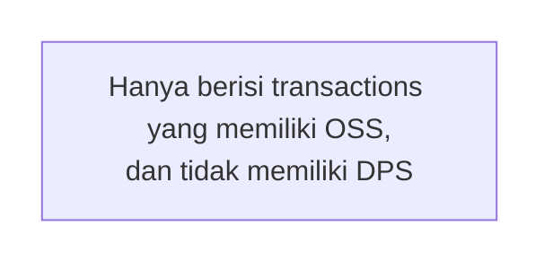
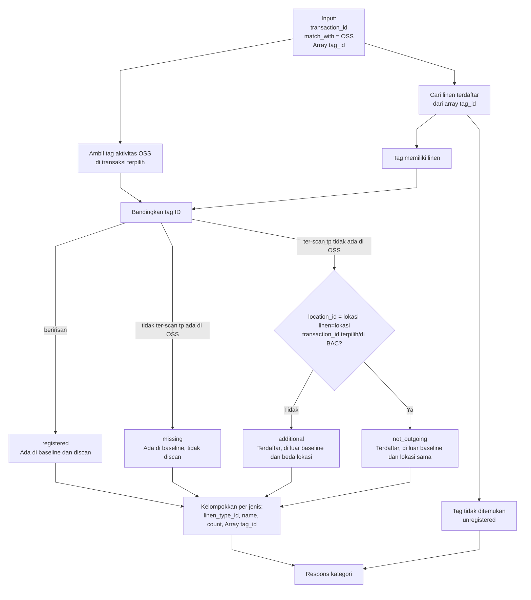
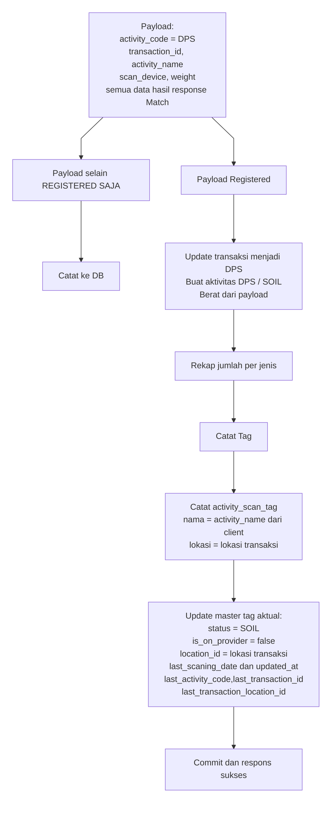

## Get List Transaction

```mermaid
%%{init: {'flowchart': {'curve': 'linear', 'nodeSpacing': 60, 'rankSpacing': 80, 'diagramPadding': 24}}}%%
flowchart TD
    N_IN["Hanya berisi transactions yang memiliki OSS,<br/>dan tidak memiliki DPS"]

```
## Match Scanned Tag ID

```mermaid
%%{init: {'flowchart': {'curve': 'linear', 'nodeSpacing': 60, 'rankSpacing': 80, 'diagramPadding': 24}}}%%
flowchart TD
    N_IN["Input:<br/>transaction_id<br/>match_with = OSS<br/>Array tag_id"]

    N_IN --> N_MASTER["Cari linen terdaftar<br/>dari array tag_id"]
    N_MASTER --> N_REGISTERED["Tag memiliki linen"]
    N_MASTER --> N_UNREG["Tag tidak ditemukan<br/>unregistered"]

    N_IN --> N_BASE["Ambil tag aktivitas OSS<br/>di transaksi terpilih"]
    N_BASE --> N_COMP["Bandingkan tag ID"]
    N_REGISTERED --> N_COMP

    N_COMP -->|beririsan| N_MATCH["registered<br/>Ada di baseline dan discan"]
    N_COMP --> |tidak ter-scan tp ada di OSS|N_MISS["missing<br/>Ada di baseline, tidak discan"]
    N_COMP --> |ter-scan tp tidak ada di OSS|N_CHECK_ADD{"location_id = lokasi linen=lokasi<br/>transaction_id terpilih/di BAC?"}

    N_CHECK_ADD -->|Ya| N_NOT_OUT["not_outgoing<br/>Terdaftar, di luar baseline dan lokasi sama"]
    N_CHECK_ADD -->|Tidak| N_ADD["additional<br/>Terdaftar, di luar baseline dan beda lokasi"]

    N_MATCH --> N_GROUP["Kelompokkan per jenis:<br/>linen_type_id, name, count, Array tag_id"]
    N_MISS --> N_GROUP
    N_ADD --> N_GROUP
    N_NOT_OUT --> N_GROUP
    N_GROUP --> N_RES["Respons kategori"]
    N_UNREG --> N_RES

    class N_CHECK_ADD,N_NOT_OUT danger
```

## Submit

```mermaid
%%{init: {'flowchart': {'curve': 'linear', 'nodeSpacing': 60, 'rankSpacing': 80, 'diagramPadding': 24}}}%%
flowchart TD
    N_IN["Payload:<br/>activity_code = DPS<br/>transaction_id, activity_name<br/>scan_device, weight<br/>semua data hasil response Match"]
    N_IN --> N_NMATCH["Payload selain REGISTERED SAJA"]
    N_NMATCH --> N_NOTES["Catat ke DB"]
    N_IN --> N_MATCH["Payload Registered"]
    N_MATCH --> N_ACT["Update transaksi menjadi DPS<br/>Buat aktivitas DPS / SOIL<br/>Berat dari payload"]

    N_ACT --> N_QTY["Rekap jumlah per jenis"]

    N_QTY --> N_REAL["Catat Tag"]
    N_REAL --> N_SCAN["Catat activity_scan_tag<br/>nama = activity_name dari client<br/>lokasi = lokasi transaksi"]
    N_SCAN --> N_MASTER["Update master tag aktual:<br/>status = SOIL<br/>is_on_provider = false<br/>location_id = lokasi transaksi<br/>last_scaning_date dan updated_at<br/>last_activity_code,last_transaction_id<br/>last_transaction_location_id"]
    N_MASTER --> N_DONE["Commit dan respons sukses"]

    class N_NMATCH,N_NOTES,N_MATCH danger
```
