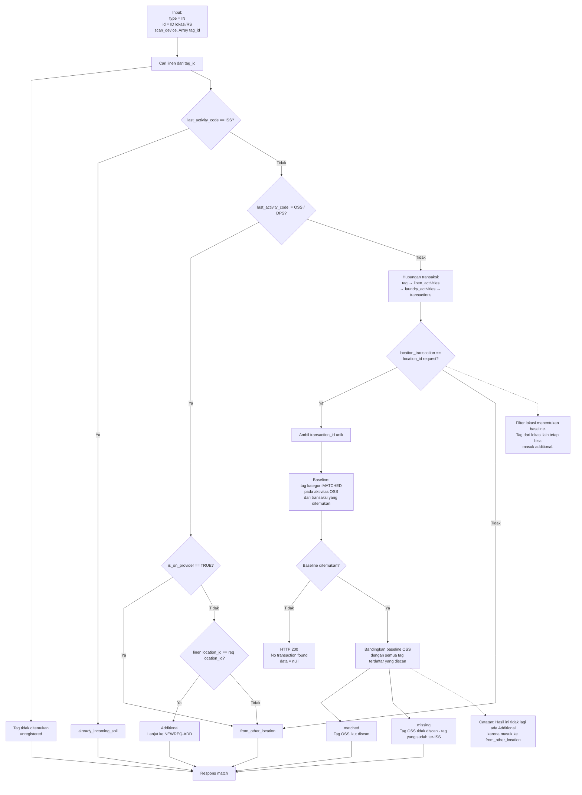
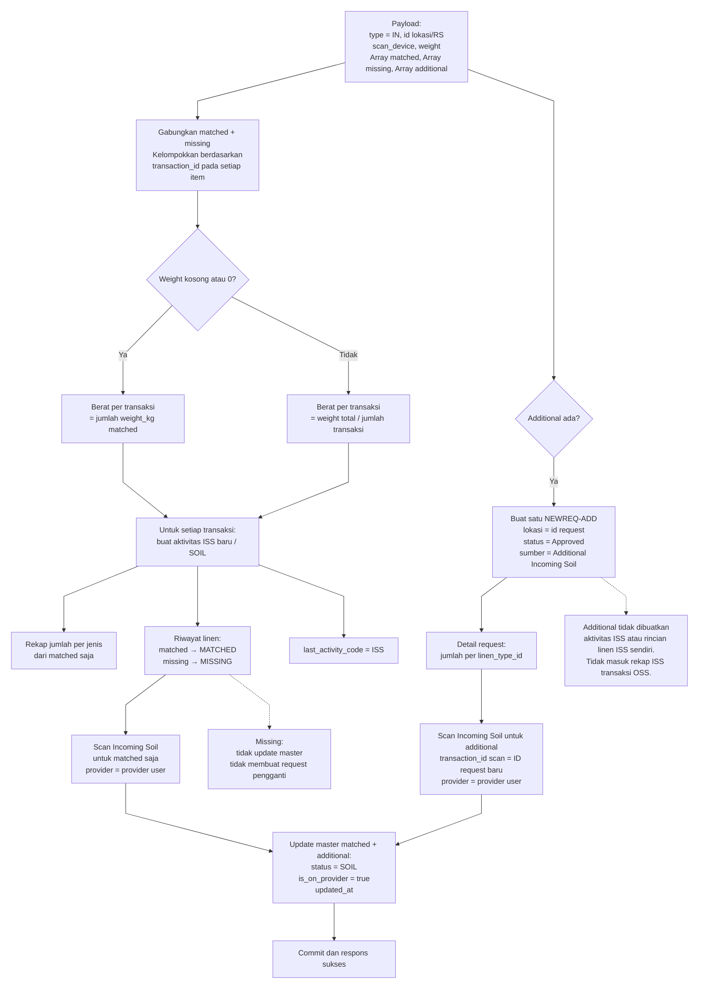
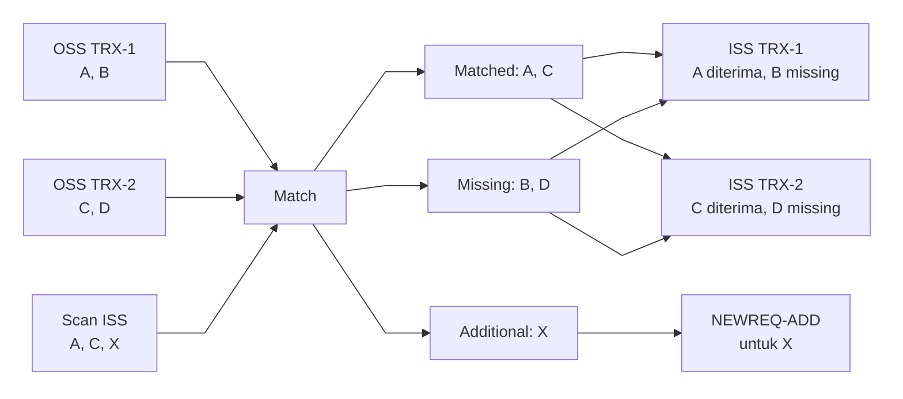

## Match Scanned Tag ID

```mermaid
%%{init: {'flowchart': {'curve': 'linear', 'nodeSpacing': 60, 'rankSpacing': 80, 'diagramPadding': 24}}}%%
flowchart TD
    N_IN["Input:<br/>type = IN<br/>id = ID lokasi/RS<br/>scan_device, Array tag_id"]

    N_IN --> N_LOOKUP["Cari linen dari tag_id"]

    N_LOOKUP --> N_UNREG["Tag tidak ditemukan<br/>unregistered"]
    N_LOOKUP --> N_CHECK_ISS{"last_activity_code == ISS?"}

    N_CHECK_ISS -->|Ya| N_ALREADY["already_incoming_soil"]
    N_CHECK_ISS -->|Tidak| N_CHECK_ACT{"last_activity_code != OSS / DPS?"}

    N_CHECK_ACT -->|Ya| N_CHECK_PROV{"is_on_provider == TRUE?"}
    N_CHECK_PROV -->|Ya| N_OTHERLOC["from_other_location"]
    N_CHECK_PROV -->|Tidak| N_CHECK_LOC2{"linen location_id == req location_id?"}
    N_CHECK_LOC2 -->|Ya| N_ADD_NEWREQ["Additional<br/>Lanjut ke NEWREQ-ADD"]
    N_CHECK_LOC2 -->|Tidak| N_OTHERLOC

    N_CHECK_ACT -->|Tidak| N_HISTORY["Hubungan transaksi:<br/>tag → linen_activities<br/>→ laundry_activities → transactions"]

    N_HISTORY --> N_FILTER{"location_transaction == location_id request?"}
    N_FILTER -->|Ya| N_IDS["Ambil transaction_id unik"]
    N_FILTER -->|Tidak| N_OTHERLOC
    N_IDS --> N_BASE["Baseline:<br/>tag kategori MATCHED<br/>pada aktivitas OSS<br/>dari transaksi yang ditemukan"]

    N_BASE --> N_EXISTS{"Baseline ditemukan?"}
    N_EXISTS -->|Tidak| N_EMPTY["HTTP 200<br/>No transaction found<br/>data = null"]
    N_EXISTS -->|Ya| N_COMP["Bandingkan baseline OSS<br/>dengan semua tag terdaftar yang discan"]

    N_COMP --> N_MATCH["matched<br/>Tag OSS ikut discan"]
    N_COMP --> N_MISS["missing<br/>Tag OSS tidak discan - tag yang sudah ter-ISS"]
    N_COMP -.-> N_ADDNOTE["Catatan: Hasil ini tidak lagi ada Additional<br/>karena masuk ke from_other_location"]
    N_MATCH --> N_RES["Respons match"]
    N_MISS --> N_RES
    N_UNREG --> N_RES
    N_ALREADY --> N_RES
    N_OTHERLOC --> N_RES
    N_ADD_NEWREQ --> N_RES

    N_FILTER -.-> N_LOCNOTE["Filter lokasi menentukan baseline.<br/>Tag dari lokasi lain tetap bisa<br/>masuk additional."]

    class N_CHECK_ISS,N_CHECK_ACT danger
```

## Submit

```mermaid
%%{init: {'flowchart': {'curve': 'linear', 'nodeSpacing': 60, 'rankSpacing': 80, 'diagramPadding': 24}}}%%
flowchart TD
    N_IN["Payload:<br/>type = IN, id lokasi/RS<br/>scan_device, weight<br/>Array matched, Array missing, Array additional"]

    N_IN --> N_GROUP["Gabungkan matched + missing<br/>Kelompokkan berdasarkan<br/>transaction_id pada setiap item"]

    N_GROUP --> N_WEIGHT{"Weight kosong atau 0?"}
    N_WEIGHT -->|Ya| N_AUTO["Berat per transaksi<br/>= jumlah weight_kg matched"]
    N_WEIGHT -->|Tidak| N_SPLIT["Berat per transaksi<br/>= weight total / jumlah transaksi"]
    N_AUTO --> N_ACT["Untuk setiap transaksi:<br/>buat aktivitas ISS baru / SOIL"]
    N_SPLIT --> N_ACT

    N_ACT --> N_QTY["Rekap jumlah per jenis<br/>dari matched saja"]
    N_ACT --> N_DETAIL["Riwayat linen:<br/>matched → MATCHED<br/>missing → MISSING"]
    N_ACT --> N_TRX["last_activity_code = ISS"]
    N_DETAIL --> N_SCAN["Scan Incoming Soil<br/>untuk matched saja<br/>provider = provider user"]

    N_IN --> N_ADD{"Additional ada?"}
    N_ADD -->|Ya| N_REQ["Buat satu NEWREQ-ADD<br/>lokasi = id request<br/>status = Approved<br/>sumber = Additional Incoming Soil"]
    N_REQ --> N_REQDETAIL["Detail request:<br/>jumlah per linen_type_id"]
    N_REQDETAIL --> N_ADDSCAN["Scan Incoming Soil untuk additional<br/>transaction_id scan = ID request baru<br/>provider = provider user"]

    N_SCAN --> N_MASTER["Update master matched + additional:<br/>status = SOIL<br/>is_on_provider = true<br/>updated_at"]
    N_ADDSCAN --> N_MASTER
    N_MASTER --> N_DONE["Commit dan respons sukses"]

    N_DETAIL -.-> N_MNOTE["Missing:<br/>tidak update master<br/>tidak membuat request pengganti"]
    N_REQ -.-> N_ANOTE["Additional tidak dibuatkan<br/>aktivitas ISS atau rincian linen ISS sendiri.<br/>Tidak masuk rekap ISS transaksi OSS."]
```

## 1 Scan 2 Transaksi dengan lokasi yang sama

```mermaid
%%{init: {'flowchart': {'curve': 'linear', 'nodeSpacing': 60, 'rankSpacing': 80, 'diagramPadding': 24}}}%%
flowchart LR
    N_T1["OSS TRX-1<br/>A, B"]
    N_T2["OSS TRX-2<br/>C, D"]
    N_S["Scan ISS<br/>A, C, X"]

    N_T1 --> N_COMP["Match"]
    N_T2 --> N_COMP
    N_S --> N_COMP

    N_COMP --> N_M["Matched: A, C"]
    N_COMP --> N_MS["Missing: B, D"]
    N_COMP --> N_AD["Additional: X"]

    N_M --> N_I1["ISS TRX-1<br/>A diterima, B missing"]
    N_MS --> N_I1
    N_M --> N_I2["ISS TRX-2<br/>C diterima, D missing"]
    N_MS --> N_I2
    N_AD --> N_R["NEWREQ-ADD<br/>untuk X"]
```
