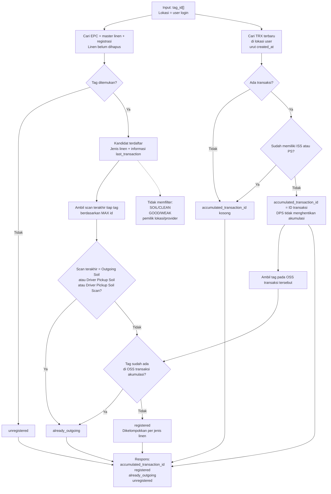
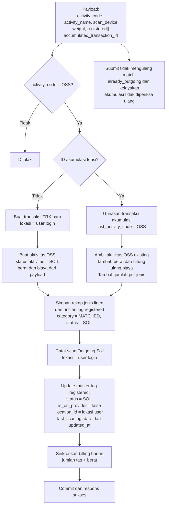

```mermaid
flowchart TD
    START["Input: tag_id[]<br/>Lokasi = user login"]

    START --> MASTER["Cari EPC + master linen + registrasi<br/>Linen belum dihapus"]
    MASTER --> FOUND{"Tag ditemukan?"}
    FOUND -->|Tidak| UNREG["unregistered"]
    FOUND -->|Ya| CAND["Kandidat terdaftar<br/>Jenis linen + informasi last_transaction"]

    START --> TRX["Cari TRX terbaru<br/>di lokasi user<br/>urut created_at"]
    TRX --> HAS{"Ada transaksi?"}
    HAS -->|Tidak| NEW["accumulated_transaction_id kosong"]
    HAS -->|Ya| CHECK{"Sudah memiliki ISS atau PS?"}
    CHECK -->|Ya| NEW
    CHECK -->|Tidak| ACC["accumulated_transaction_id = ID transaksi<br/>DPS tidak menghentikan akumulasi"]
    ACC --> EXIST["Ambil tag pada OSS transaksi tersebut"]

    CAND --> LAST["Ambil scan terakhir tiap tag<br/>berdasarkan MAX id"]
    LAST --> OUT{"Scan terakhir = Outgoing Soil<br/>atau Driver Pickup Soil<br/>atau Driver Pickup Soil Scan?"}
    OUT -->|Ya| ALREADY["already_outgoing"]
    OUT -->|Tidak| INACC{"Tag sudah ada<br/>di OSS transaksi akumulasi?"}
    EXIST --> INACC
    INACC -->|Ya| ALREADY
    INACC -->|Tidak| READY["registered<br/>Dikelompokkan per jenis linen"]

    READY --> RES["Respons:<br/>accumulated_transaction_id<br/>registered<br/>already_outgoing<br/>unregistered"]
    ALREADY --> RES
    UNREG --> RES
    ACC --> RES
    NEW --> RES

    CAND -.-> RULE["Tidak memfilter:<br/>SOIL/CLEAN<br/>GOOD/WEAK<br/>pemilik lokasi/provider"]
```

```mermaid
flowchart TD
    IN["Payload:<br/>activity_code, activity_name, scan_device<br/>weight, registered[]<br/>accumulated_transaction_id"]
    IN --> VALID{"activity_code = OSS?"}
    VALID -->|Tidak| REJECT["Ditolak"]
    VALID -->|Ya| MODE{"ID akumulasi terisi?"}

    MODE -->|Tidak| NEW["Buat transaksi TRX baru<br/>lokasi = user login"]
    NEW --> ACT["Buat aktivitas OSS<br/>status aktivitas = SOIL<br/>berat dan biaya dari payload"]

    MODE -->|Ya| OLD["Gunakan transaksi akumulasi<br/>last_activity_code = OSS"]
    OLD --> ADD["Ambil aktivitas OSS existing<br/>Tambah berat dan hitung ulang biaya<br/>Tambah jumlah per jenis"]

    ACT --> DETAIL["Simpan rekap jenis linen<br/>dan rincian tag registered<br/>category = MATCHED, status = SOIL"]
    ADD --> DETAIL
    DETAIL --> SCAN["Catat scan Outgoing Soil<br/>lokasi = user login"]
    SCAN --> MASTER["Update master tag registered:<br/>status = SOIL<br/>is_on_provider = false<br/>location_id = lokasi user<br/>last_scaning_date dan updated_at"]
    MASTER --> BILL["Sinkronkan billing harian<br/>jumlah tag + berat"]
    BILL --> DONE["Commit dan respons sukses"]

    IN -.-> TRUST["Submit tidak mengulang match:<br/>already_outgoing dan kelayakan<br/>akumulasi tidak diperiksa ulang"]
```
