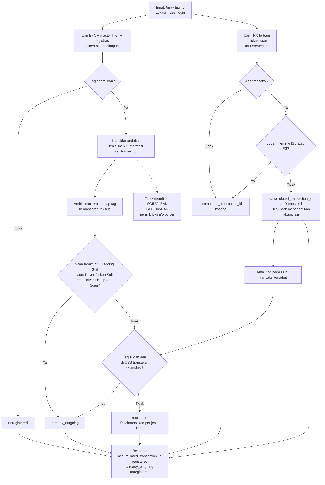
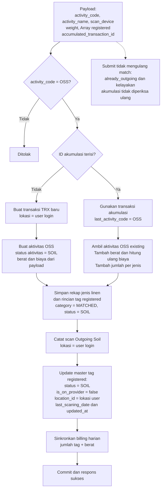

```mermaid
flowchart TD
    N_START["Input: Array tag_id<br/>Lokasi = user login"]

    N_START --> N_MASTER["Cari EPC + master linen + registrasi<br/>Linen belum dihapus"]
    N_MASTER --> N_FOUND{"Tag ditemukan?"}
    N_FOUND -->|Tidak| N_UNREG["unregistered"]
    N_FOUND -->|Ya| N_CAND["Kandidat terdaftar<br/>Jenis linen + informasi last_transaction"]

    N_START --> N_TRX["Cari TRX terbaru<br/>di lokasi user<br/>urut created_at"]
    N_TRX --> N_HAS{"Ada transaksi?"}
    N_HAS -->|Tidak| N_NEW["accumulated_transaction_id kosong"]
    N_HAS -->|Ya| N_CHECK{"Sudah memiliki ISS atau PS?"}
    N_CHECK -->|Ya| N_NEW
    N_CHECK -->|Tidak| N_ACC["accumulated_transaction_id = ID transaksi<br/>DPS tidak menghentikan akumulasi"]
    N_ACC --> N_EXIST["Ambil tag pada OSS transaksi tersebut"]

    N_CAND --> N_LAST["Ambil scan terakhir tiap tag<br/>berdasarkan MAX id"]
    N_LAST --> N_OUT{"Scan terakhir = Outgoing Soil<br/>atau Driver Pickup Soil<br/>atau Driver Pickup Soil Scan?"}
    N_OUT -->|Ya| N_ALREADY["already_outgoing"]
    N_OUT -->|Tidak| N_INACC{"Tag sudah ada<br/>di OSS transaksi akumulasi?"}
    N_EXIST --> N_INACC
    N_INACC -->|Ya| N_ALREADY
    N_INACC -->|Tidak| N_READY["registered<br/>Dikelompokkan per jenis linen"]

    N_READY --> N_RES["Respons:<br/>accumulated_transaction_id<br/>registered<br/>already_outgoing<br/>unregistered"]
    N_ALREADY --> N_RES
    N_UNREG --> N_RES
    N_ACC --> N_RES
    N_NEW --> N_RES

    N_CAND -.-> N_RULE["Tidak memfilter:<br/>SOIL/CLEAN<br/>GOOD/WEAK<br/>pemilik lokasi/provider"]
```

```mermaid
flowchart TD
    N_IN["Payload:<br/>activity_code, activity_name, scan_device<br/>weight, Array registered<br/>accumulated_transaction_id"]
    N_IN --> N_VALID{"activity_code = OSS?"}
    N_VALID -->|Tidak| N_REJECT["Ditolak"]
    N_VALID -->|Ya| N_MODE{"ID akumulasi terisi?"}

    N_MODE -->|Tidak| N_NEW["Buat transaksi TRX baru<br/>lokasi = user login"]
    N_NEW --> N_ACT["Buat aktivitas OSS<br/>status aktivitas = SOIL<br/>berat dan biaya dari payload"]

    N_MODE -->|Ya| N_OLD["Gunakan transaksi akumulasi<br/>last_activity_code = OSS"]
    N_OLD --> N_ADD["Ambil aktivitas OSS existing<br/>Tambah berat dan hitung ulang biaya<br/>Tambah jumlah per jenis"]

    N_ACT --> N_DETAIL["Simpan rekap jenis linen<br/>dan rincian tag registered<br/>category = MATCHED, status = SOIL"]
    N_ADD --> N_DETAIL
    N_DETAIL --> N_SCAN["Catat scan Outgoing Soil<br/>lokasi = user login"]
    N_SCAN --> N_MASTER["Update master tag registered:<br/>status = SOIL<br/>is_on_provider = false<br/>location_id = lokasi user<br/>last_scaning_date dan updated_at"]
    N_MASTER --> N_BILL["Sinkronkan billing harian<br/>jumlah tag + berat"]
    N_BILL --> N_DONE["Commit dan respons sukses"]

    N_IN -.-> N_TRUST["Submit tidak mengulang match:<br/>already_outgoing dan kelayakan<br/>akumulasi tidak diperiksa ulang"]
```
