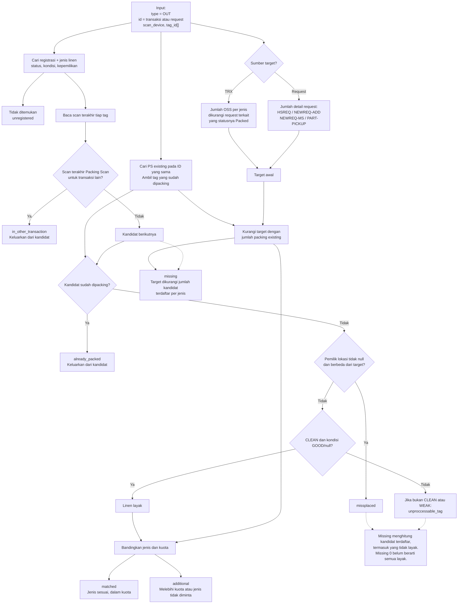
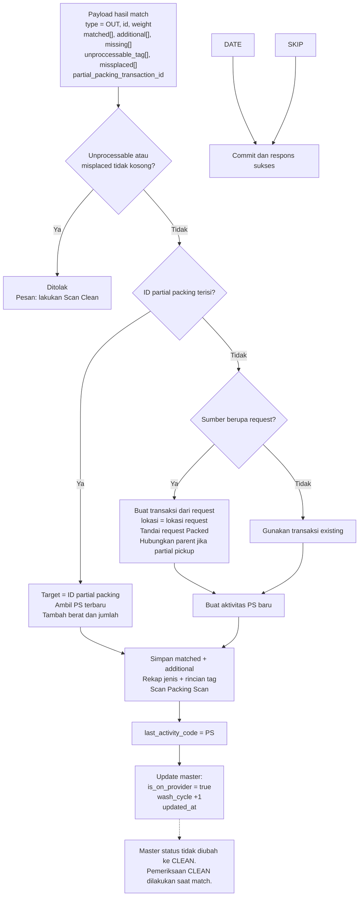

## Match Scanned Tag ID

```mermaid
flowchart TD
    IN["Input:<br/>type = OUT<br/>id = transaksi atau request<br/>scan_device, tag_id[]"]

    IN --> MASTER["Cari registrasi + jenis linen<br/>status, kondisi, kepemilikan"]
    MASTER --> UNREG["Tidak ditemukan<br/>unregistered"]
    MASTER --> LAST["Baca scan terakhir tiap tag"]
    LAST --> OTHER{"Scan terakhir Packing Scan<br/>untuk transaksi lain?"}
    OTHER -->|Ya| O["in_other_transaction<br/>Keluarkan dari kandidat"]
    OTHER -->|Tidak| CAND["Kandidat berikutnya"]

    IN --> SOURCE{"Sumber target?"}
    SOURCE -->|TRX| OSS["Jumlah OSS per jenis<br/>dikurangi request terkait<br/>yang statusnya Packed"]
    SOURCE -->|Request| REQ["Jumlah detail request:<br/>HSREQ / NEWREQ-ADD<br/>NEWREQ-MS / PART-PICKUP"]
    OSS --> TARGET["Target awal"]
    REQ --> TARGET

    IN --> EXIST["Cari PS existing pada ID yang sama<br/>Ambil tag yang sudah dipacking"]
    EXIST --> REDUCE["Kurangi target dengan<br/>jumlah packing existing"]
    TARGET --> REDUCE
    EXIST --> WAS{"Kandidat sudah dipacking?"}
    CAND --> WAS
    WAS -->|Ya| PACKED["already_packed<br/>Keluarkan dari kandidat"]
    WAS -->|Tidak| OWNER{"Pemilik lokasi tidak null<br/>dan berbeda dari target?"}
    OWNER -->|Ya| MISPLACE["missplaced"]
    OWNER -->|Tidak| CLEAN{"CLEAN dan kondisi GOOD/null?"}
    CLEAN -->|Ya| ELIGIBLE["Linen layak"]
    CLEAN -->|Tidak| BAD["Jika bukan CLEAN atau WEAK:<br/>unproccessable_tag"]

    ELIGIBLE --> COMP["Bandingkan jenis dan kuota"]
    REDUCE --> COMP
    COMP --> MATCH["matched<br/>Jenis sesuai, dalam kuota"]
    COMP --> ADD["additional<br/>Melebihi kuota atau jenis tidak diminta"]

    REDUCE --> MISS["missing<br/>Target dikurangi jumlah kandidat<br/>terdaftar per jenis"]
    CAND -.-> MISS
    MISPLACE -.-> NOTE["Missing menghitung kandidat terdaftar,<br/>termasuk yang tidak layak.<br/>Missing 0 belum berarti semua layak."]
    BAD -.-> NOTE
```

## Submit

```mermaid
flowchart TD
    IN["Payload hasil match<br/>type = OUT, id, weight<br/>matched[], additional[], missing[]<br/>unproccessable_tag[], missplaced[]<br/>partial_packing_transaction_id"]

    IN --> BLOCK{"Unprocessable atau<br/>misplaced tidak kosong?"}
    BLOCK -->|Ya| REJECT["Ditolak<br/>Pesan: lakukan Scan Clean"]
    BLOCK -->|Tidak| MODE{"ID partial packing terisi?"}

    MODE -->|Ya| PART["Target = ID partial packing<br/>Ambil PS terbaru<br/>Tambah berat dan jumlah"]
    MODE -->|Tidak| SOURCE{"Sumber berupa request?"}
    SOURCE -->|Ya| REQ["Buat transaksi dari request<br/>lokasi = lokasi request<br/>Tandai request Packed<br/>Hubungkan parent jika partial pickup"]
    SOURCE -->|Tidak| NORMAL["Gunakan transaksi existing"]
    REQ --> CREATE["Buat aktivitas PS baru"]
    NORMAL --> CREATE

    PART --> SAVE["Simpan matched + additional<br/>Rekap jenis + rincian tag<br/>Scan Packing Scan"]
    CREATE --> SAVE
    SAVE --> TRX["last_activity_code = PS"]
    TRX --> MASTER["Update master:<br/>is_on_provider = true<br/>wash_cycle +1<br/>updated_at"]
    DATE --> DONE["Commit dan respons sukses"]
    SKIP --> DONE

    MASTER -.-> STATUS["Master status tidak diubah ke CLEAN.<br/>Pemeriksaan CLEAN dilakukan saat match."]
```