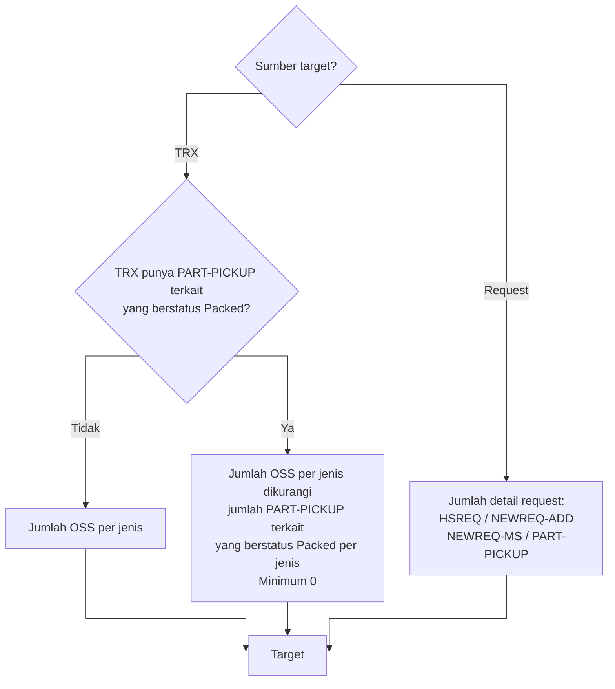
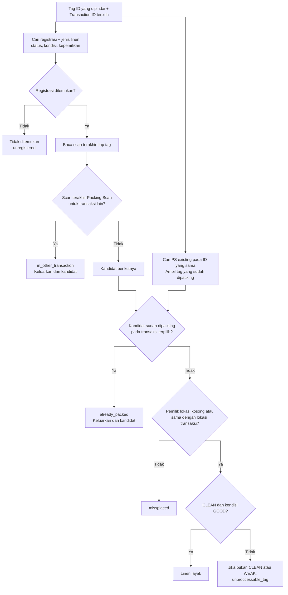
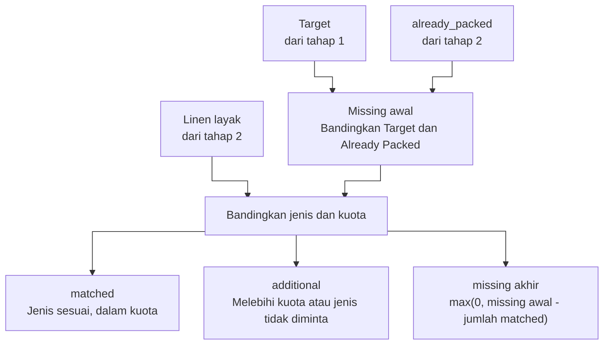
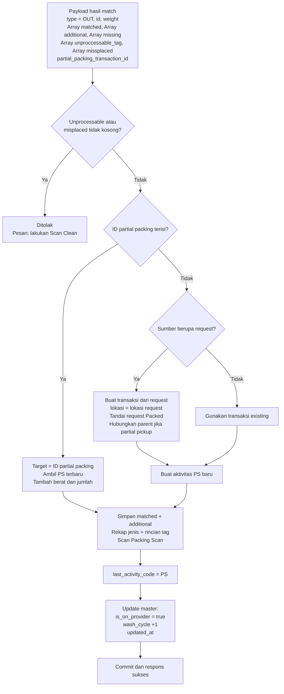
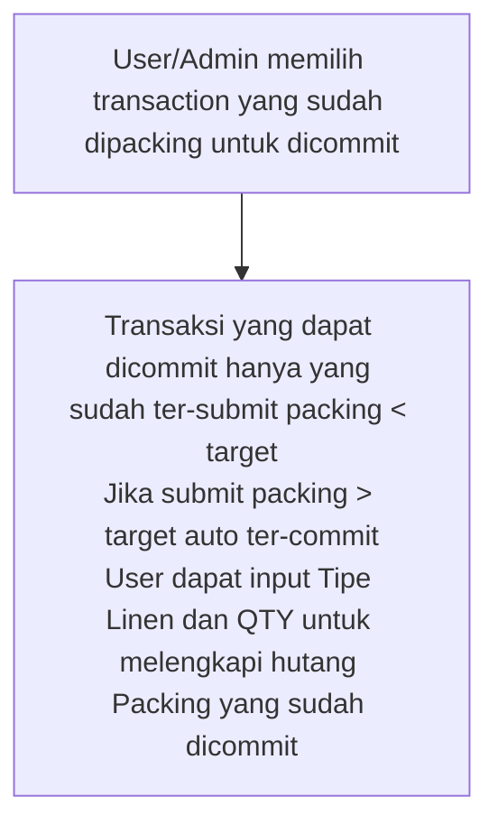

## Match Scanned Tag ID

Input: `type = OUT`, `id` transaksi atau request, `scan_device`, dan array `tag_id`.
**Target** dari tahap 1 serta **already_packed** dan **linen layak** dari tahap 2
menjadi masukan tahap 3.

### 1. Tentukan target

### 2. Periksa kandidat tag

### 3. Bandingkan target dan hasil scan

Nama masukan di bawah merujuk ke keluaran tahap 1 dan 2.

## Submit

## Commit Packing

