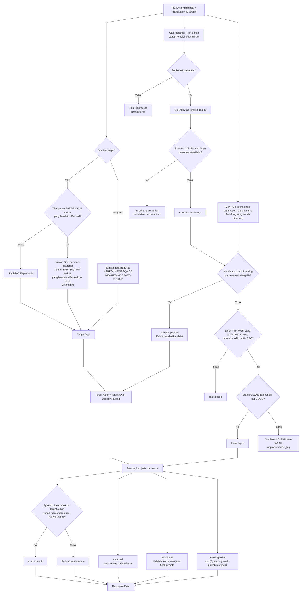
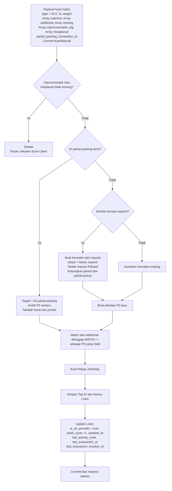
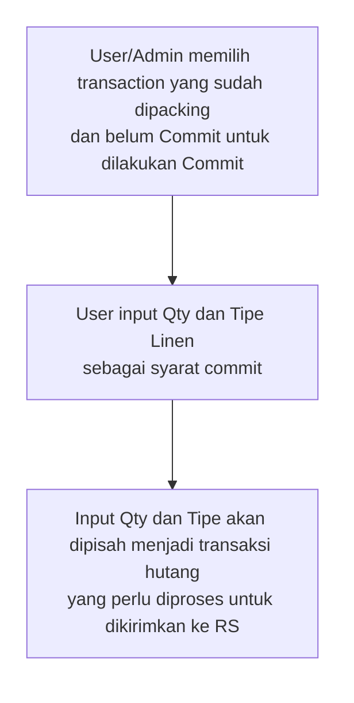

## Match Scanned Tag ID

Input: `type = OUT`, `id` transaksi atau request, `scan_device`, dan array `tag_id`.

```mermaid
%%{init: {'flowchart': {'curve': 'linear', 'nodeSpacing': 60, 'rankSpacing': 80, 'diagramPadding': 24}}}%%
flowchart TD
    N_IN["Tag ID yang dipindai + Transaction ID terpilih"]
    N_IN --> N_SOURCE{"Sumber target?"}
    N_SOURCE -->|TRX| N_PART_PACKED{"TRX punya PART-PICKUP terkait<br/>yang berstatus Packed?"}
    N_PART_PACKED -->|Tidak| N_OSS_FULL["Jumlah OSS per jenis"]
    N_OSS_FULL --> N_TARGET["Target Awal"]
    N_PART_PACKED -->|Ya| N_OSS["Jumlah OSS per jenis dikurangi<br/>jumlah PART-PICKUP terkait<br/>yang berstatus Packed per jenis<br/>Minimum 0"]
    N_SOURCE -->|Request| N_REQ["Jumlah detail request:<br/>HSREQ / NEWREQ-ADD<br/>NEWREQ-MS / PART-PICKUP"]
    N_OSS --> N_TARGET
    N_REQ --> N_TARGET

    N_IN --> N_MASTER["Cari registrasi + jenis linen<br/>status, kondisi, kepemilikan"]
    N_MASTER --> N_FOUND{"Registrasi ditemukan?"}
    N_FOUND -->|Tidak| N_UNREG["Tidak ditemukan<br/>unregistered"]
    N_FOUND -->|Ya| N_LAST["Cek Aktivitas terakhir Tag ID"]
    N_LAST --> N_OTHER{"Scan terakhir Packing Scan<br/>untuk transaksi lain?"}
    N_OTHER -->|Ya| N_O["in_other_transaction<br/>Keluarkan dari kandidat"]
    N_OTHER -->|Tidak| N_CAND["Kandidat berikutnya"]
    N_IN --> N_EXIST["Cari PS existing pada transaction ID yang sama<br/>Ambil tag yang sudah dipacking"]
    N_EXIST --> N_WAS{"Kandidat sudah dipacking<br/>pada transaksi terpilih?"}
    N_CAND --> N_WAS
    N_WAS -->|Ya| N_PACKED["already_packed<br/>Keluarkan dari kandidat"]
    N_WAS -->|Tidak| N_OWNER{"Linen milik lokasi yang sama dengan lokasi<br/> transaksi ATAU milik BAC?"}
    N_OWNER -->|Tidak| N_MISPLACE["missplaced"]
    N_OWNER -->|Ya| N_CLEAN{"status CLEAN dan kondisi tag GOOD?"}
    N_CLEAN -->|Ya| N_ELIGIBLE["Linen layak"]
    N_CLEAN -->|Tidak| N_BAD["Jika bukan CLEAN atau WEAK:<br/>unproccessable_tag"]

    N_TARGET --> N_REDUCE["Target Akhir = Target Awal - Already Packed"]
    N_PACKED --> N_REDUCE
    N_ELIGIBLE --> N_COMP["Bandingkan jenis dan kuota"]

    N_COMP --> N_COMM{"Apakah Linen Layak >= Target Akhir?<br/>Tanpa memandang tipe. Hanya total qty"}
    N_COMM -->|Ya| N_AUTO["Auto Commit"]
    N_COMM -->|Tidak| N_ADMIN["Perlu Commit Admin"]

    N_REDUCE --> N_COMP
    N_COMP --> N_MATCH["matched<br/>Jenis sesuai, dalam kuota"]
    N_COMP --> N_ADD["additional<br/>Melebihi kuota atau jenis tidak diminta"]

    N_COMP --> N_MISS["missing akhir<br/>max(0, missing awal - jumlah matched)"]

    N_MISS -->N_RES["Response Data"]
    N_ADD -->N_RES
    N_MATCH -->N_RES
    N_AUTO -->N_RES
    N_ADMIN -->N_RES

    class N_COMM,N_AUTO,N_ADMIN danger
```

## Submit

```mermaid
%%{init: {'flowchart': {'curve': 'linear', 'nodeSpacing': 60, 'rankSpacing': 80, 'diagramPadding': 24}}}%%
flowchart TD
    N_IN["Payload hasil match<br/>type = OUT, id, weight<br/>Array matched, Array additional, Array missing<br/>Array unproccessable_tag, Array missplaced<br/>partial_packing_transaction_id<br/>Commit Auto/Manual"]

    N_IN --> N_BLOCK{"Unprocessable atau<br/>misplaced tidak kosong?"}
    N_BLOCK -->|Ya| N_REJECT["Ditolak<br/>Pesan: lakukan Scan Clean"]
    N_BLOCK -->|Tidak| N_MODE{"ID partial packing terisi?"}

    N_MODE -->|Ya| N_PART["Target = ID partial packing<br/>Ambil PS terbaru<br/>Tambah berat dan jumlah"]
    N_MODE -->|Tidak| N_SOURCE{"Sumber berupa request?"}
    N_SOURCE -->|Ya| N_REQ["Buat transaksi dari request<br/>lokasi = lokasi request<br/>Tandai request Packed<br/>Hubungkan parent jika partial pickup"]
    N_SOURCE -->|Tidak| N_NORMAL["Gunakan transaksi existing"]
    N_REQ --> N_CREATE["Buat aktivitas PS baru"]
    N_NORMAL --> N_CREATE

    N_PART --> N_SAVE["Match dan Additional dianggap MATCH -><br/>sebagai PS yang Valid"]
    N_CREATE --> N_SAVE
    N_SAVE --> N_QTY["Buat Rekap Jenis/Qty"]
    N_QTY --> N_TAG["Simpan Tag ID dan history Linen"]
    N_TAG --> N_MASTER["Update Linen:<br/>is_on_provider = true, wash_cycle +1, updated_at<br/>last_activity_code, last_transaction_id<br/>last_transaction_location_id"]
    N_MASTER --> N_DONE["Commit dan respons sukses"]

    class N_SAVE,N_SUM, danger
```

## Commit Packing

```mermaid
%%{init: {'flowchart': {'curve': 'linear', 'nodeSpacing': 60, 'rankSpacing': 80, 'diagramPadding': 24}}}%%
flowchart TD
    N_IN["User/Admin memilih transaction yang sudah dipacking<br/>dan belum Commit untuk dilakukan Commit"]

    N_IN --> N_LIST["User input Qty dan Tipe Linen<br/>sebagai syarat commit"]
    N_LIST -->N_TRX["Input Qty dan Tipe akan dipisah menjadi transaksi hutang<br/>yang perlu diproses untuk dikirimkan ke RS"]

    class N_IN,N_LIST,N_TRX danger
```
