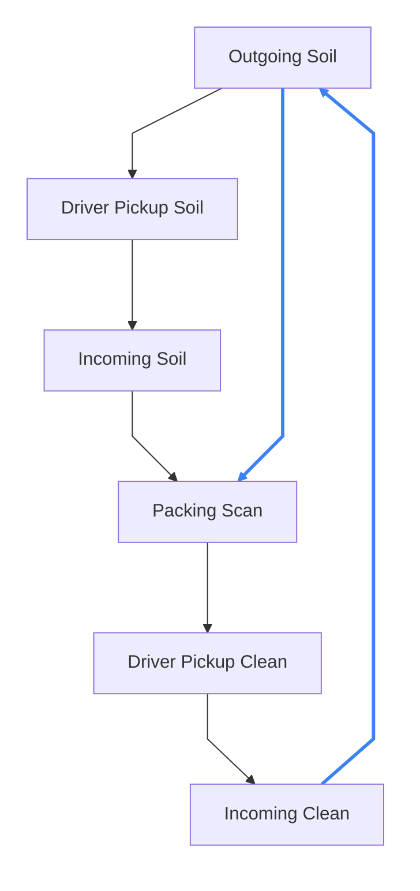

## Full Laundry Flow

```mermaid
%%{init: {'flowchart': {'curve': 'linear', 'nodeSpacing': 60, 'rankSpacing': 80, 'diagramPadding': 24}}}%%
flowchart TD
    N_OSS["Outgoing Soil"]
    N_OSS --> N_DPS["Driver Pickup Soil"]
    N_DPS --> N_ISS["Incoming Soil"]
    N_ISS --> N_PS["Packing Scan"]
    N_PS --> N_DPC["Driver Pickup Clean"]
    N_DPC --> N_IC["Incoming Clean"]

    N_OSS -->N_PS
    N_IC -->N_OSS
    

    linkStyle 5,6 stroke:#3b82f6,stroke-width:3px
```
