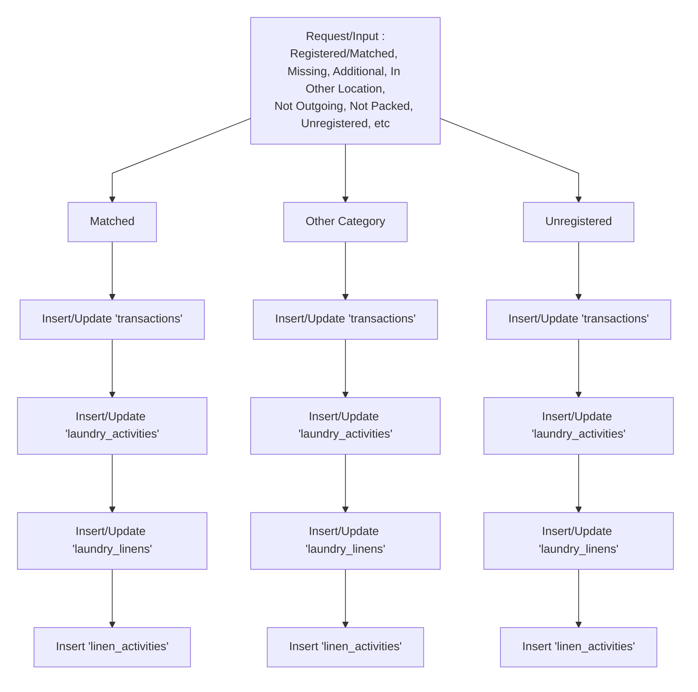

```mermaid
%%{init: {'flowchart': {'curve': 'linear', 'nodeSpacing': 60, 'rankSpacing': 80, 'diagramPadding': 24}}}%%
flowchart TD
    N_REQ["Request/Input :<br/>Registered/Matched, Missing, Additional, In Other Location,<br/>Not Outgoing, Not Packed, Unregistered, etc"]
    N_REQ --> N_MATCH["Matched"]
    N_REQ --> N_OTHERS["Other Category"]
    N_REQ --> N_UNREG["Unregistered"]

    N_MATCH -->N_MTRX["Insert/Update 'transactions'"]
    N_MTRX -->N_MLACT["Insert/Update 'laundry_activities'"]
    N_MLACT -->N_MLL["Insert/Update 'laundry_linens'"]
    N_MLL -->N_MLICT["Insert 'linen_activities'"]

    N_OTHERS -->N_OTRX["Insert/Update 'transactions'"]
    N_OTRX -->N_OLACT["Insert/Update 'laundry_activities'"]
    N_OLACT -->N_OLL["Insert/Update 'laundry_linens'"]
    N_OLL -->N_OLICT["Insert 'linen_activities'"]

    N_UNREG -->N_UTRX["Insert/Update 'transactions'"]
    N_UTRX -->N_ULACT["Insert/Update 'laundry_activities'"]
    N_ULACT -->N_ULL["Insert/Update 'laundry_linens'"]
    N_ULL -->N_ULICT["Insert 'linen_activities'"]

    class N_MATCH,N_MTRX,N_MLACT,N_MLL,N_MLICT info
    class N_OTHERS,N_OTRX,N_OLACT,N_OLL,N_OLICT warning
    class N_UNREG,N_UTRX,N_ULACT,N_ULL,N_ULICT danger
    

```
